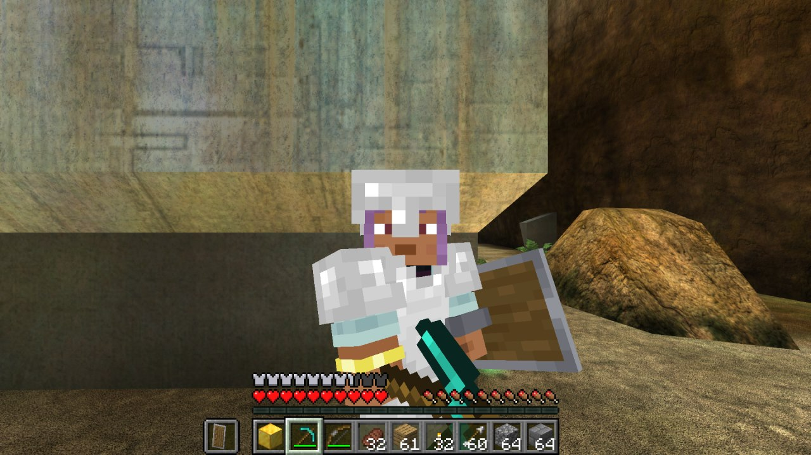
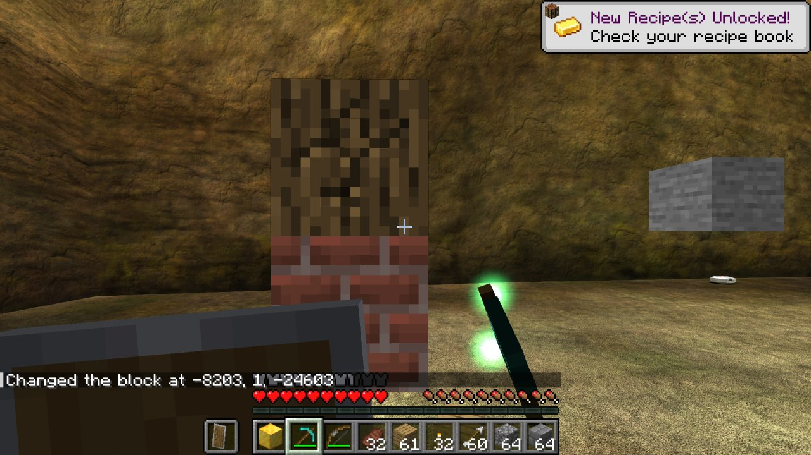

# HaloCraft

Play Halo: Combat Evolved (Steam MCC) as a Minecraft player.



HaloCraft is a port of [SkyCraft](https://github.com/chasmlol/SkyCraft) (Minecraft in Skyrim) to
Halo CE. Real Minecraft Java runs hidden in the background with a Fabric mod, a mod inside Halo
talks to it through shared memory, and Halo draws everything: Minecraft's hand, HUD and screens in
Halo's frame, and Minecraft's blocks, items and Steve's body in Halo's world, lit and hidden behind
walls by Halo's own camera and depth buffer.

> **Status: early and experimental.** Building, inventory, Minecraft movement and third person work
> and were tested live. Combat with Halo's enemies is written but not tested in a campaign yet.



## What works

- **Minecraft's HUD and screens** inside Halo's frame: hotbar, hearts, hunger, armour, XP, chat,
  inventory, crafting, toasts. Halo's own HUD and gun are hidden while Minecraft is connected.
- **Input**: keyboard and mouse go to Minecraft. While a Minecraft screen is open Halo is frozen and
  the mouse moves Minecraft's cursor.
- **Movement**: Minecraft's physics (walk, sprint, jump, sneak) on Halo's level geometry, which is
  streamed to Minecraft as collision. Chief follows Steve; Halo's camera sits at Minecraft's eye.
- **Building**: place and break blocks on Halo's ground, with cracks, the targeted-block outline,
  dropped items and pickup. Blocks are drawn with Halo's exact view-projection and depth-tested
  against Halo's scene.
- **Third person (F5)**: Steve's own animated body, armour and held items, both camera modes.
- **Every Halo map gets its own patch of the Minecraft world**, so builds stay on their map.
- **Mining Halo's terrain**: Halo's ground, rock and structures dig out one block at a time (or by
  the crater with TNT) and drop the matching Minecraft block, from the level's collision materials:
  dirt is grass, sand is sand, rock is stone, metal (Forerunner and human) is iron, wood is planks,
  glass, ice, snow, leaves. Under it is dirt, stone with ores, then bedrock. Halo's own ground
  disappears inside dug blocks (screen-space, against Halo's depth) and Minecraft draws the hole's
  walls. Water, force fields, shields and the level's invisible walls stay.

- **Combat (untested)**: every Halo character near you is a hittable stand-in in Minecraft (swords,
  crits, knockback, bows); Minecraft's hits take Halo's shield then health (20 Minecraft damage per
  bar) and kills go through Halo's own damage code; Halo's damage to Chief becomes Minecraft damage
  (Chief's shield + health = Steve's 20 health), and Steve dying kills Chief.

## Not yet

- Halo characters don't flinch from non-lethal Minecraft hits.
- Vehicles (Halo drives Chief while you're in one), cutscenes.
- Block lighting follows Minecraft's light levels only (always daytime), not Halo's lightmaps.
- The Minecraft side still says "Skyrim" in its logs.

## Running it (development)

You need Halo: The Master Chief Collection on Steam with Halo: CE installed, Minecraft: Java
Edition, Visual Studio 2022 Build Tools (C++), Premake 5 and JDK 25. **Offline only, with
anti-cheat disabled. Never use mods online.**

```powershell
git clone --recursive https://github.com/festella22/halocraft
cd halocraft
premake5 vs2022
MSBuild.exe halocraft.sln /p:Configuration=Release /p:Platform=Win64
```

1. Start Minecraft with the mod: `cd fabric; .\gradlew runClient` (a dev account; it hides its
   window once Halo connects).
2. `tools\halo_dev.ps1`: installs `halocraft.dll` into MCC's `mods` folder, starts MCC without
   anti-cheat and injects [Spark](https://github.com/KodyJKing/spark).
3. Load any Halo CE level (campaign or a local custom game).

`tools\halo_reload.ps1` rebuilds and hot-reloads the Halo side while MCC keeps running.

| Key | Does |
|---|---|
| Esc | Halo's pause menu (or closes a Minecraft screen) |
| E, 1-9, scroll, Q, T, / | Minecraft, as usual |
| F5 | Minecraft's camera: first person, behind, in front |
| F9 | Spark: unload all mods |

## Layout

| Folder | |
|---|---|
| `halo/` | The Halo side: a Spark mod (C++, DirectX 11) |
| `fabric/` | SkyCraft's Minecraft mod (Java, Fabric), with small HaloCraft changes |
| `protocol/` | The shared-memory layout both sides follow |
| `vendor/spark/` | Spark, the Halo CE MCC mod loader (submodule) |
| `skse/` | SkyCraft's Skyrim plugin, kept as reference |

How SkyCraft works: [docs/SKYCRAFT.md](docs/SKYCRAFT.md) and [docs/DESIGN.md](docs/DESIGN.md).

## Credits

- [SkyCraft](https://github.com/chasmlol/SkyCraft) by chasmlol (MIT): the whole two-games design,
  the Minecraft mod, and the code the Halo side's link, compositor, collision voxelizer and entity
  geometry are ported from.
- [Spark](https://github.com/KodyJKing/spark) by KodyJKing: Halo CE MCC mod loader and SDK
  (linked as a submodule, not copied).

Fan project, not affiliated with Mojang, Microsoft, 343 Industries or Halo Studios. You need to own
both games.
