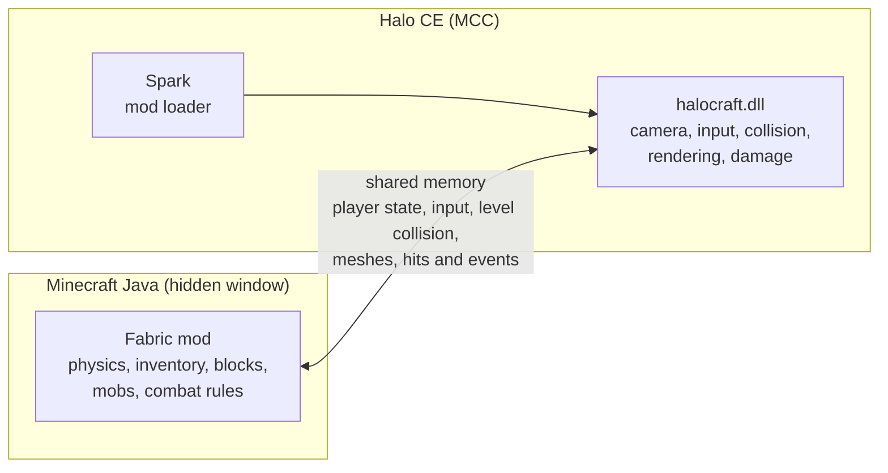

# HaloCraft

**Minecraft inside Halo: Combat Evolved.** Build, mine, craft and fight on Halo's levels with
real Minecraft mechanics, drawn by Halo itself.

[](https://github.com/festella22/halocraft/releases/latest)


[](LICENSE)


This isn't an overlay. Real Minecraft Java runs hidden in the background, a mod inside Halo talks
to it through shared memory, and Halo renders everything: Minecraft's hand, HUD and inventory in
Halo's frame, and Minecraft's blocks, items, mobs and Steve's body in Halo's world, through Halo's
own camera and hidden behind Halo's walls. HaloCraft is a port of
[SkyCraft](https://github.com/chasmlol/SkyCraft) (Minecraft in Skyrim) to Halo CE.

> **Early and experimental.** Everything below works and was played live, but expect rough edges.

## Features

**Building and mining**
- Place and break blocks anywhere on Halo's levels, with Minecraft's cracks, outline, drops and pickup.
- Mine Halo's own terrain a block at a time, or blow craters in it with TNT. Each block drops what
  it's made of: dirt gives grass, sand gives sand, rock gives stone, Forerunner and human metal give
  iron, wood gives planks. Under the surface is dirt, then stone with ores, then bedrock.

**Combat**
- Minecraft weapons hurt Halo's Covenant and Flood. Hits land as Halo melee hits (flinches, shield
  flares, knockback). A Grunt falls to two sword hits, an Elite to three or four.
- Jump crits are real (and land like headshots). Bows shoot dead straight and drawing one zooms
  like Halo's sniper scope.
- Halo's damage to Chief becomes Minecraft damage, and if Steve dies, Chief dies.
- Minecraft's mobs join in: zombies, skeletons and creepers attack Halo's characters, iron golems
  defend you against the Covenant.

**Minecraft, in Halo**
- Minecraft's HUD, inventory, crafting, chat and commands, inside Halo's frame.
- Minecraft movement (walk, sprint, jump, sneak, swim) on Halo's level geometry. Chief follows
  Steve and Halo's camera sits at Steve's eye.
- Third person with F5: Steve's animated body, armour and held items.
- Every level load starts fresh: an empty patch of the Minecraft world and a starter kit (sword,
  tools, building blocks).


## Download and play

You need **Halo: The Master Chief Collection** on Steam with Halo: CE installed, and a Microsoft
account that owns **Minecraft: Java Edition**.

1. Download `HaloCraft-<version>.zip` from the
   [latest release](https://github.com/festella22/halocraft/releases/latest) and unzip it anywhere.
2. Double-click `HaloCraft.exe`. It starts the Minecraft that plays inside Halo (hidden), starts
   MCC through Steam with anti-cheat disabled, and loads HaloCraft into it.
3. Pick any Halo CE level: a campaign mission or a local custom game.

The first time, a Prism Launcher window asks you to sign in to Minecraft and then downloads
Minecraft and Java (a few minutes). After that it's one click. Minecraft quits by itself when you
quit Halo, and if anything didn't start, run `HaloCraft.exe` again: it only starts what's missing.

> [!WARNING]
> **Offline only.** HaloCraft runs MCC with anti-cheat disabled. Never take mods online.

> [!NOTE]
> `HaloCraft.exe` isn't code-signed, so Windows may show "Windows protected your PC" the first
> time: click **More info**, then **Run anyway**.

### Controls

| Key | Does |
|---|---|
| E, 1-9, scroll, Q, T, / | Minecraft, as usual |
| F5 | Minecraft's camera: first person, behind, in front |
| Esc | Halo's pause menu (or closes a Minecraft screen) |
| F9 | Unload all mods (Spark) |

## How it works



- **Halo to Minecraft:** Halo's level collision (its BSP, with each surface's material), the
  camera, your input, and every nearby Halo character, mirrored in Minecraft as an invisible
  stand-in that Minecraft's weapons and mobs can hit.
- **Minecraft to Halo:** where Steve is (Chief follows), Minecraft's frame for the HUD and
  screens, block meshes, entities and particles, which Halo draws with its own view-projection
  and depth buffer, and every hit, which goes through Halo's own damage code.

## Known limitations

- The Covenant don't shoot back at Minecraft's mobs yet (mobs hurt them, they ignore the mobs).
- Vehicles and cutscenes: Halo takes back control of Chief while you're in a vehicle.
- Blocks are always lit like daytime; Halo's lighting doesn't reach them yet.
- Halo's bullets and AI don't see Minecraft blocks, so walls you build aren't cover.

## Building from source

You need Visual Studio 2022 Build Tools (C++), [Premake 5](https://premake.github.io/) and JDK 25.

```powershell
git clone --recursive https://github.com/festella22/halocraft
cd halocraft
$env:JAVA_HOME = "<path to JDK 25>"
powershell -ExecutionPolicy Bypass -File tools\package.ps1
```

That builds everything into `dist\HaloCraft` (ready to run) and `dist\HaloCraft-<version>.zip`.

For development: `cd fabric; .\gradlew runClient` starts Minecraft with a dev account,
`tools\halo_dev.ps1` installs the mod, starts MCC and injects Spark, and `tools\halo_reload.ps1`
rebuilds and hot-reloads the Halo side while MCC keeps running.

| Folder | |
|---|---|
| `halo/` | The Halo side: a Spark mod (C++, DirectX 11) |
| `launcher/` | `HaloCraft.exe`, the one-click launcher |
| `fabric/` | The Minecraft mod (Java, Fabric), SkyCraft's with HaloCraft changes |
| `protocol/` | The shared-memory layout both sides follow |
| `vendor/spark/` | [Spark](https://github.com/KodyJKing/spark), the Halo CE MCC mod loader (submodule) |
| `tools/` | Packaging, dev launch and hot-reload scripts, the bundled Prism Launcher setup |
| `skse/` | SkyCraft's Skyrim plugin, kept as reference |

More on the design SkyCraft and HaloCraft share: [docs/SKYCRAFT.md](docs/SKYCRAFT.md) and
[docs/DESIGN.md](docs/DESIGN.md).

## Credits

- [SkyCraft](https://github.com/chasmlol/SkyCraft) by chasmlol (MIT): the two-games design, the
  Minecraft mod, and the code the Halo side's link, compositor, collision voxelizer, digging and
  entity geometry are ported from.
- [Spark](https://github.com/KodyJKing/spark) by KodyJKing: the Halo CE MCC mod loader and SDK
  HaloCraft runs on.
- [Prism Launcher](https://prismlauncher.org/) (GPL-3.0), bundled to sign in to and start Minecraft.
- Inspired by the Minecraft-in-Elden-Ring mod.

See [THIRD-PARTY-NOTICES.md](THIRD-PARTY-NOTICES.md) for licenses.

## License

MIT, see [LICENSE](LICENSE). Spark and Prism Launcher come under their own terms.

HaloCraft is a fan project, not affiliated with or endorsed by Mojang, Microsoft, 343 Industries,
Halo Studios or Bungie. You need to own both games.
